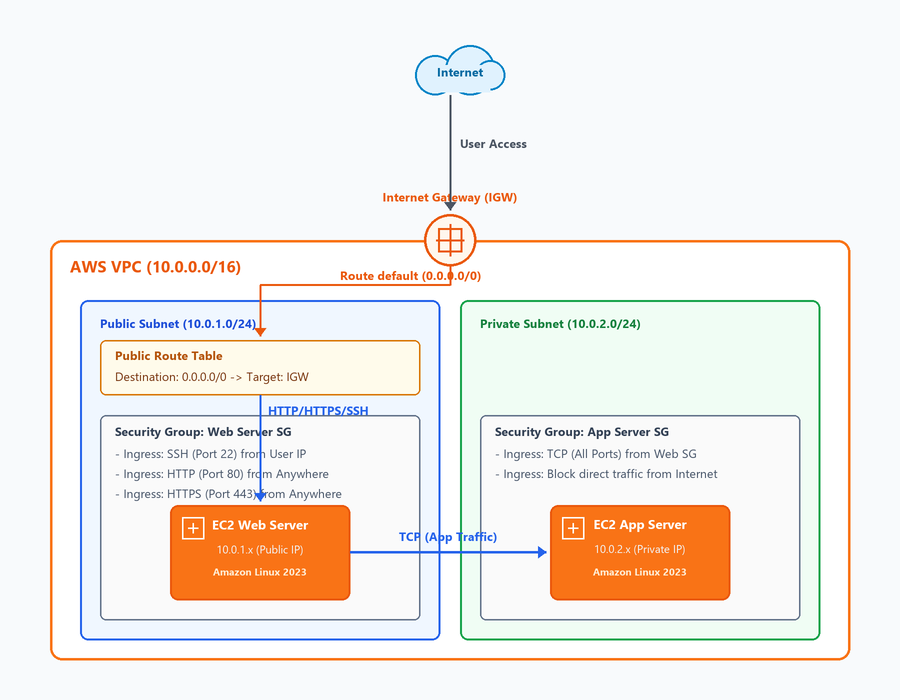
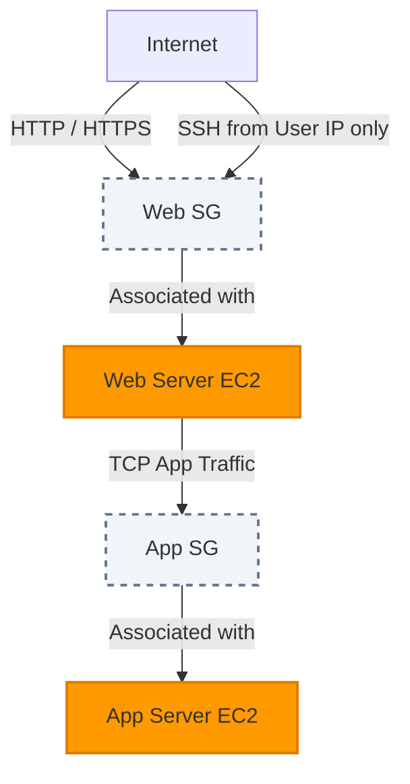

# Simple AWS VPC Design

[](https://opensource.org/licenses/MIT)
[](https://www.terraform.io/)
[](https://aws.amazon.com/)

A beginner-friendly project demonstrating core cloud networking principles on Amazon Web Services (AWS) using Terraform infrastructure-as-code (IaC).

---

## 🗺️ Architecture Diagram

Below is the network architecture diagram generated using AWS design principles:



*The editable Draw.io version of this diagram can be found in [architecture.drawio](./architecture.drawio), and a vector version in [architecture.svg](./architecture.svg).*

---

## 📝 Project Overview

This project implements a secure, two-tier network architecture within a Virtual Private Cloud (VPC). It separates public-facing resources from private backend applications.

### Key Networking Features:
* **Two-Tier Isolation**: Segregates public web servers from private application servers.
* **Granular Firewalls**: Utilizes stateful Security Groups to restrict traffic strictly by group association.
* **Automated Provisioning**: The entire environment is defined and deployed using Terraform.

---

## ⚙️ Network & Subnet CIDR Layout

| Component | CIDR Block | Available IPs | Routing | Purpose |
| :--- | :--- | :--- | :--- | :--- |
| **VPC** | `10.0.0.0/16` | 65,536 | Local | Core network boundary |
| **Public Subnet** | `10.0.1.0/24` | 251 | Route to IGW (`0.0.0.0/0`) | Houses public Web Servers |
| **Private Subnet** | `10.0.2.0/24` | 251 | Local only (Isolated) | Houses backend Application Servers |

*Note: AWS reserves 5 IP addresses in each subnet for internal networking requirements.*

---

## 🛠️ AWS Services & Infrastructure Components

1. **Amazon VPC**: The logically isolated virtual network boundary.
2. **Subnets**: Public Subnet (with direct Internet access) and Private Subnet (isolated).
3. **Internet Gateway (IGW)**: Attaches to the VPC to enable internet access for the public subnet.
4. **Route Table**: Maps public subnet traffic to the IGW.
5. **Security Groups**:
   * **Web Server SG**: Allows inbound SSH (Port 22), HTTP (Port 80), and HTTPS (Port 443).
   * **App Server SG**: Restricts inbound traffic strictly to connections originating from the Web Server SG.
6. **EC2 Instances**:
   * **Web Server**: Deployed in the Public Subnet (Amazon Linux 2023).
   * **App Server**: Deployed in the Private Subnet (Amazon Linux 2023).

---

## 🔒 Security Design

This project implements AWS security best practices:


* **Zero Direct Public Access**: The application server has no public IP address and sits in a private subnet.
* **Security Group Chaining**: The App Server Security Group does not allow traffic from specific IPs; instead, it trusts any instance belonging to the Web Server Security Group.
* **Restricted SSH Access**: Management access (SSH) is locked down to a specific user-defined IP address instead of being open to the world.

---

## 📂 Repository Folder Structure

```
simple-vpc-design/
│
├── README.md                 # Project summary and documentation landing
├── LICENSE                   # MIT License
├── .gitignore                # Standard Git ignore rules for Terraform & Python
├── architecture.png          # High-resolution network architecture diagram
├── architecture.svg          # Vector-based scalable architecture diagram
├── architecture.drawio       # Editable Draw.io file for diagrams.net
│
├── docs/                     # Detailed technical documentations
│   ├── design.md             # Theoretical guide (VPC, Subnets, Gateways, SGs)
│   └── architecture.md       # Technical specs & resource parameters
│
├── terraform/                # Infrastructure-as-Code files
│   ├── main.tf               # Primary resource block declarations
│   ├── variables.tf          # Configurable variables
│   ├── outputs.tf            # Operational output values (IPs, IDs)
│   ├── provider.tf           # Terraform and AWS provider definitions
│   └── terraform.tfvars.example # Example tfvars file template
│
└── images/
    └── architecture.png      # Embedded asset for README rendering
```

---

## 🚀 Deployment Steps

### Prerequisites:
1. [AWS CLI](https://aws.amazon.com/cli/) installed and configured with credentials.
2. [Terraform CLI](https://developer.hashicorp.com/terraform/downloads) (v1.2.0+) installed.

### Steps:

1. **Clone the Repository**:
   ```bash
   git clone https://github.com/yourusername/simple-vpc-design.git
   cd simple-vpc-design/terraform
   ```

2. **Configure Variables**:
   Copy the example variables file:
   ```bash
   cp terraform.tfvars.example terraform.tfvars
   ```
   Edit `terraform.tfvars` and set your public IP address to authorize SSH access:
   ```hcl
   allowed_ssh_ip = "YOUR_PUBLIC_IP/32"
   ```

3. **Initialize Terraform**:
   ```bash
   terraform init
   ```

4. **Verify Plan**:
   Review the resources that will be created:
   ```bash
   terraform plan
   ```

5. **Deploy Infrastructure**:
   ```bash
   terraform apply
   ```
   *Type `yes` when prompted to confirm deployment.*

6. **Tear Down Resources**:
   To clean up and avoid AWS charges:
   ```bash
   terraform destroy
   ```

---

## 🎓 Learning Outcomes

By deploying this project, you will learn:
* How to design a basic two-tier network structure in AWS.
* How routing works between the internet, public subnets, and isolated private subnets.
* The difference between NACLs (subnet firewalls) and Security Groups (instance firewalls).
* How to use Terraform to write dry, parameter-driven infrastructure definitions.

---

## 📈 Future Improvements

In a real production environment, you would enhance this design by adding:
1. **Multi-AZ Availability**: Duplicate the subnet structure across a second Availability Zone (e.g., Public Subnet B, Private Subnet B) behind an Application Load Balancer.
2. **NAT Gateway**: Deploy a NAT Gateway in the public subnet to allow private instances to fetch updates safely from the internet.
3. **IAM Role Integration**: Bind IAM Instance Profiles to EC2 instances to grant AWS API permissions securely without hardcoded credentials.

---

## 👥 Author

* **Lokesh C**
* GitHub: [@lokeshc-tech](https://github.com/clokesh5054-a11)

---

## ⚖️ License

This project is licensed under the MIT License - see the [LICENSE](./LICENSE) file for details.
